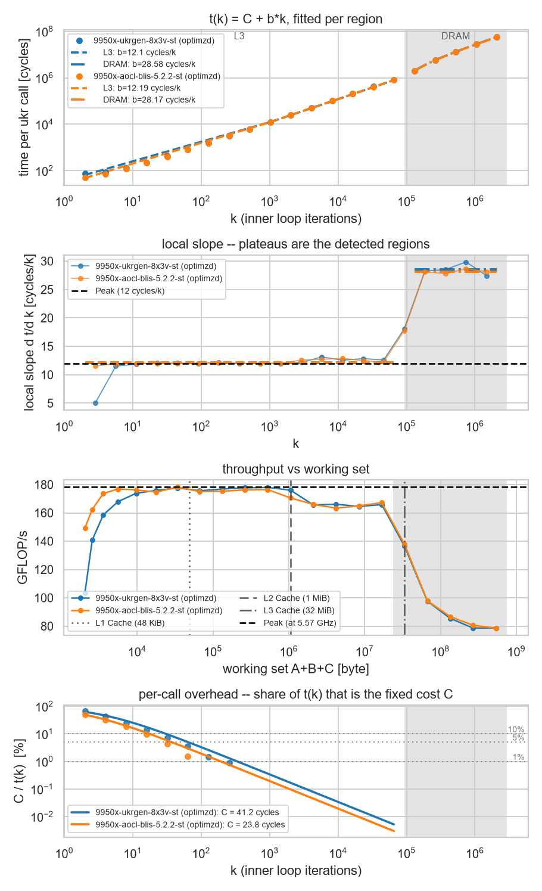

How to use analyze.py:
======================

You need numpy. For plotting you'll also need matplotlib+seaborn

Usage:
------

```
usage: analyze.py [-h] [--mr MR] [--nr NR] [--threads THREADS] [--y {auto,cycles,ns}] [--ghz GHZ] [--peak FLOP_PER_CYCLE] [--tol TOL] [--min-points MIN_POINTS] [--min-slope-ratio MIN_SLOPE_RATIO] [--min-span MIN_SPAN] [--max-segments MAX_SEGMENTS]
                  [--segments SEGMENTS] [--breaks BREAKS] [--caches CACHES] [--unroll N] [--usable USABLE] [--min-size MIN_SIZE] [--max-size MAX_SIZE] [--plot [FILE]] [--no-scan]
                  csv [csv ...]

Piecewise-linear fit of BLIS microkernel scaling data.

Reads the CSV written by the ukr benchmark, e.g.

    # ukr implementation: optimzd
    # ukr size:            16x32
    # threads:             1
    Size[Byte],[GFLOP/s],FLOPS,cycles/iter,l1d_read_miss/iter
    4864,20.8372,3584,266,0
    ...

mr/nr/thread count are taken from the '#' header when present, so k can be
recovered from the working-set size:

    size = (mr*k + nr*k + mr*nr) * sizeof(double)

The cost of one microkernel call is modelled as

    t(k) = C + b*k

with C the fixed per-call overhead (C load/store, prologue) and b the cost of
one rank-1 update: mr*nr FMAs over (mr+nr) freshly streamed doubles.  b jumps
whenever the A/B panels stop fitting in a cache level, so t(k) is piecewise
linear in k and the slope of each piece is the interesting number: it gives
FLOP/cycle while the panels are in cache, and effective bandwidth once they
are not.

The segment boundaries are found automatically (dynamic programming over all
contiguous splits, fewest segments that keep every point within --tol of its
segment's line), so no size thresholds have to be hardcoded per machine.

Every b comes with its standard error, because a window that does not reach far
enough in k cannot pin down a slope -- there b trades off against C and the fit
will happily return a value the hardware cannot reach.  Pass --peak (FLOP/cycle)
to have such fits flagged outright.

If the file has no cycle counter (only Size and GFLOP/s), t(k) is recovered from
GFLOP/s in nanoseconds; --ghz converts that to cycles per call.

Only numpy is required; matplotlib is needed just for --plot.

positional arguments:
  csv                   benchmark output file(s)

options:
  -h, --help            show this help message and exit
  --mr MR               override microkernel MR (default: from '# ukr size')
  --nr NR               override microkernel NR
  --threads THREADS     override thread count (only used if the file has no FLOPS column)
  --y {auto,cycles,ns}  quantity to fit: measured cycles/iter, or ns/iter derived from GFLOP/s
  --ghz GHZ             clock frequency; with no cycle counter in the file this converts the derived ns into cycles, so b and C come out in cycles per call
  --peak FLOP_PER_CYCLE
                        theoretical peak of the microkernel, e.g. 128 for one 8x8 f64 FMOPA per cycle; adds a %peak column and flags any fit that beats it
  --tol TOL             max relative deviation inside a region, in % (default: 3)
  --min-points MIN_POINTS
                        minimum points per region (default: 3)
  --min-slope-ratio MIN_SLOPE_RATIO
                        merge neighbouring regions whose slopes differ by less than this factor (default: 1.25); 1 keeps every breakpoint the fit finds
  --min-span MIN_SPAN   a region must cover at least this factor in t(k) (default: 1.5); stops the overhead-dominated small-k points from forming a bogus region
  --max-segments MAX_SEGMENTS
                        upper bound on the number of regions
  --segments SEGMENTS   force exactly this many regions
  --breaks BREAKS       force boundaries at these working-set sizes, e.g. 512K,8M
  --caches CACHES       cache capacities for labelling, e.g. 32K,512K,32M; also prints the largest k that fits each level
  --unroll N            k-unroll factor of the microkernel; checks whether the sweep always lands on the same residue mod N (then the tail cost hides in C)
  --usable USABLE       fraction of each cache assumed available to the panels (default: 1); 0.75 leaves one way of a 4-way cache for the other streams
  --min-size MIN_SIZE   ignore points below this working-set size
  --max-size MAX_SIZE   ignore points above this working-set size
  --plot [FILE]         draw the fits; with a filename, save instead of showing
  --no-scan             hide the segment-count scan
```


Example for 9950x:
------------------

Comparing results for AOCL-BLIS and a [ukrgen](https://github.com/linedot/ukrgen) generated microkernel:

```
ᐅ python ../analyze.py 9950x-ukrgen-8x3v-st.csv 9950x-aocl-blis-5.2.2-st.csv --peak 32 --caches 48K,1M,32M --unroll 4 --tol 5
================================================================================================
9950x-ukrgen-8x3v-st (optimzd)
  ukr 8x24   threads 1   t(k) in cycles per call (measured cycles)   ~5.572 GHz
  21 points   k 2..2097152   working set 2 KiB..512 MiB
  cache limits (usable fraction 1):
    L1    48 KiB:  A+B+C resident for k <= 186       |  B panel alone for k <= 256
    L2     1 MiB:  A+B+C resident for k <= 4090      |  B panel alone for k <= 5461
    L3    32 MiB:  A+B+C resident for k <= 131066    |  B panel alone for k <= 174762
  segment scan (rel. RMSE / worst deviation / meets --tol):
    1 segment : rel.RMSE  22.56%   worst  52.12%   no
    2 segments: rel.RMSE   3.95%   worst  11.56%   no
    3 segments: rel.RMSE   2.46%   worst   6.40%   no
    4 segments: rel.RMSE   1.87%   worst   6.40%   no
    5 segments: rel.RMSE   1.86%   worst   6.40%   no
    6 segments: rel.RMSE   1.86%   worst   6.40%   no
  note: no split keeps every point within --tol 5.0% (noisy data?); showing the best-scoring split instead
  note: sampled k covers residues [0, 2] mod 4; points on the tail path carry an extra fixed cost the others do not, which shows up as scatter in maxdev, not in b
-----------------------------------------------------------------------------------------------------------------------------------------------
  seg      pts          k range          working set   b [cycles/k]     +/-  C [cycles]      R^2   maxdev  FLOP/cycle   B/cycle   %peak  miss/k
-----------------------------------------------------------------------------------------------------------------------------------------------
  1 L3      16         2..65536        2 KiB..16 MiB         12.101   0.170        41.2  0.99762   11.56%       31.73     21.16   99.2%    4.02
  2 DRAM     5  131072..2097152      32 MiB..512 MiB         28.582   0.249  -1737126.7  0.99964    2.09%       13.43      8.96   42.0%    4.00
-----------------------------------------------------------------------------------------------------------------------------------------------
  intercepts:
    region 1: C = 41.2 +/- 2.5 cycles per call
    region 2: C = -1737127 +/- 47925 cycles is not a per-call cost -- it is the region starting out partly served at region 1's 12.101 cycles/k
               -> k_res = 105399 (25.7 MiB of A+B) still resident; compare against the last-level cache
  overhead amortisation (region 1: C = 41.2, b = 12.101):
    C is 20% of t(k) at k = 14,  10% of t(k) at k = 31,  5% of t(k) at k = 65
    at the L1 A+B+C limit k = 186, C is 1.8% of t(k)
  1: t(k) = 41.25 + 12.1010*k cycles   ->  31.7 FLOP/cycle, 21.16 B/cycle, 117.9 GB/s @ 5.57 GHz
  2: t(k) = -1737126.73 + 28.5823*k cycles   ->  13.4 FLOP/cycle, 8.96 B/cycle, 49.9 GB/s @ 5.57 GHz

================================================================================================
9950x-aocl-blis-5.2.2-st (optimzd)
  ukr 8x24   threads 1   t(k) in cycles per call (measured cycles)   ~5.504 GHz
  21 points   k 2..2097152   working set 2 KiB..512 MiB
  cache limits (usable fraction 1):
    L1    48 KiB:  A+B+C resident for k <= 186       |  B panel alone for k <= 256
    L2     1 MiB:  A+B+C resident for k <= 4090      |  B panel alone for k <= 5461
    L3    32 MiB:  A+B+C resident for k <= 131066    |  B panel alone for k <= 174762
  segment scan (rel. RMSE / worst deviation / meets --tol):
    1 segment : rel.RMSE  21.79%   worst  51.84%   no
    2 segments: rel.RMSE   1.68%   worst   3.96%   yes
    3 segments: rel.RMSE   0.54%   worst   1.30%   yes
    4 segments: rel.RMSE   0.38%   worst   0.83%   yes
    5 segments: rel.RMSE   0.31%   worst   0.83%   yes
    6 segments: rel.RMSE   0.31%   worst   0.83%   yes
  note: sampled k covers residues [0, 2] mod 4; points on the tail path carry an extra fixed cost the others do not, which shows up as scatter in maxdev, not in b
-----------------------------------------------------------------------------------------------------------------------------------------------
  seg      pts          k range          working set   b [cycles/k]     +/-  C [cycles]      R^2   maxdev  FLOP/cycle   B/cycle   %peak  miss/k
-----------------------------------------------------------------------------------------------------------------------------------------------
  1 L3      16         2..65536        2 KiB..16 MiB         12.188   0.071        23.8  0.99933    3.96%       31.51     21.00   98.5%    4.01
  2 DRAM     5  131072..2097152      32 MiB..512 MiB         28.170   0.100  -1717249.6  0.99997    0.83%       13.63      9.09   42.6%    4.00
-----------------------------------------------------------------------------------------------------------------------------------------------
  intercepts:
    region 1: C = 23.8 +/- 0.8 cycles per call
    region 2: C = -1717250 +/- 19320 cycles is not a per-call cost -- it is the region starting out partly served at region 1's 12.188 cycles/k
               -> k_res = 107448 (26.2 MiB of A+B) still resident; compare against the last-level cache
  overhead amortisation (region 1: C = 23.8, b = 12.188):
    C is 20% of t(k) at k = 8,  10% of t(k) at k = 18,  5% of t(k) at k = 37
    at the L1 A+B+C limit k = 186, C is 1.0% of t(k)
  1: t(k) = 23.82 + 12.1878*k cycles   ->  31.5 FLOP/cycle, 21.00 B/cycle, 115.6 GB/s @ 5.50 GHz
  2: t(k) = -1717249.59 + 28.1700*k cycles   ->  13.6 FLOP/cycle, 9.09 B/cycle, 50.0 GB/s @ 5.50 GHz
```


resulting plots:


